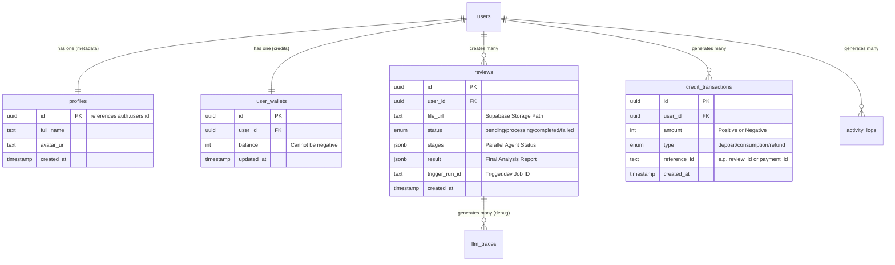

# AI 辅助论文审批系统数据库设计 (Supabase Schema)

| 版本号 | 修订日期 | 修改描述 | 作者 |
| :--- | :--- | :--- | :--- |
| V1.0 | 2026-03-15 | 初始版本：基于 Trigger.dev + Realtime 的核心表结构设计 | Colin |

---

## 1. 设计概述 (Design Overview)

本数据库设计旨在支撑 **AI 辅助论文智能审批网站 (V2.0)** 的核心业务流程。
设计遵循 **"Supabase-First"** 原则：
1.  利用 **Supabase Auth** 进行身份验证。
2.  利用 **Row Level Security (RLS)** 在数据库层级严格控制数据访问权限。
3.  利用 **Realtime** 实现前端实时进度更新。
4.  利用 **JSONB** 字段灵活存储非结构化的 Agent 审阅结果。

### 1.1 核心实体关系图 (ER Diagram)



---

## 2. 表结构定义 (Table Definitions)

### 2.1 用户档案表 (`public.profiles`)
用于存储 `auth.users` 之外的用户扩展信息。

```sql
create table public.profiles (
  id uuid not null references auth.users(id) on delete cascade primary key,
  full_name text,
  avatar_url text,
  role text default 'user' check (role in ('user', 'admin')),
  created_at timestamptz default now(),
  updated_at timestamptz default now()
);

-- RLS: 用户只能读取/修改自己的资料
alter table public.profiles enable row level security;
create policy "Users can view own profile" on profiles for select using (auth.uid() = id);
create policy "Users can update own profile" on profiles for update using (auth.uid() = id);
```

### 2.2 用户钱包表 (`public.user_wallets`)
存储用户的点数余额。

```sql
create table public.user_wallets (
  id uuid default gen_random_uuid() primary key,
  user_id uuid not null references auth.users(id) on delete cascade unique,
  balance int not null default 0 check (balance >= 0), -- 余额不可为负
  created_at timestamptz default now(),
  updated_at timestamptz default now()
);

-- RLS: 用户只能查看余额，严禁直接修改 (必须通过 Server Action 或 Trigger.dev)
alter table public.user_wallets enable row level security;
create policy "Users can view own wallet" on user_wallets for select using (auth.uid() = user_id);
-- Update Policy: 仅限 Service Role (后端) 修改
```

### 2.3 交易流水表 (`public.credit_transactions`)
记录每一笔点数变动，用于审计和对账。**Append-only (只增不改)**。

```sql
create type transaction_type as enum ('deposit', 'consumption', 'refund', 'system_gift');

create table public.credit_transactions (
  id uuid default gen_random_uuid() primary key,
  user_id uuid not null references auth.users(id) on delete cascade,
  amount int not null, -- 正数表示增加，负数表示扣除
  type transaction_type not null,
  reference_id text, -- 关联的 Review ID 或 Payment ID
  description text,
  created_at timestamptz default now()
);

-- Index for faster query
create index idx_transactions_user_id on credit_transactions(user_id);

-- RLS: 用户只能查看自己的流水
alter table public.credit_transactions enable row level security;
create policy "Users can view own transactions" on credit_transactions for select using (auth.uid() = user_id);
```

### 2.4 核心审阅任务表 (`public.reviews`)
存储论文审阅任务的状态、进度和结果。

```sql
create type review_status as enum ('pending', 'processing', 'completed', 'failed', 'cancelled');

create table public.reviews (
  id uuid default gen_random_uuid() primary key,
  user_id uuid not null references auth.users(id) on delete cascade,
  
  -- 文件信息
  file_url text not null, -- 存储在 Supabase Storage 中的路径
  file_name text, -- 原始文件名
  page_count int, -- 页数 (用于计费核对)
  
  -- 任务状态
  status review_status not null default 'pending',
  trigger_run_id text, -- Trigger.dev 任务 ID，方便追踪日志
  
  -- 进度追踪 (Parallel Agents)
  -- 结构示例: [{id: 'format', status: 'completed'}, {id: 'logic', status: 'processing'}]
  stages jsonb default '[]'::jsonb, 
  
  -- 最终结果
  result jsonb, -- 包含 format_result, logic_result, reference_result 等
  error_message text, -- 如果失败，记录错误原因
  
  created_at timestamptz default now(),
  updated_at timestamptz default now(),
  completed_at timestamptz
);

-- Index
create index idx_reviews_user_id on reviews(user_id);
create index idx_reviews_status on reviews(status);

-- Realtime: 必须开启 Replica Identity 以支持 Update 推送
alter table public.reviews replica identity full;

-- RLS
alter table public.reviews enable row level security;
create policy "Users can view own reviews" on reviews for select using (auth.uid() = user_id);
create policy "Users can create reviews" on reviews for insert with check (auth.uid() = user_id);
-- Update Policy: 仅限 Service Role (Trigger.dev) 修改状态
```

### 2.5 审计日志表 (`public.activity_logs`)
记录关键操作日志 (PRD 8.2)。

```sql
create table public.activity_logs (
  id uuid default gen_random_uuid() primary key,
  user_id uuid references auth.users(id) on delete set null,
  action text not null, -- e.g., 'UPLOAD_FILE', 'START_REVIEW', 'DOWNLOAD_REPORT'
  metadata jsonb, -- e.g., { "file_size": 1024, "ip": "1.2.3.4" }
  ip_address text,
  created_at timestamptz default now()
);

-- RLS: 仅管理员可见
alter table public.activity_logs enable row level security;
-- (Admin Policy to be added)
```

### 2.6 LLM 调试追踪表 (`public.llm_traces`)
用于调试 Bad Case，记录每次 LLM 的输入输出。

```sql
create table public.llm_traces (
  id uuid default gen_random_uuid() primary key,
  review_id uuid references reviews(id) on delete set null,
  agent_name text, -- e.g., 'format_agent'
  model_name text, -- e.g., 'gpt-4o'
  prompt_tokens int,
  completion_tokens int,
  cost_usd numeric(10, 6),
  latency_ms int,
  input_snapshot text, -- 截断存储，避免过大
  output_snapshot text,
  created_at timestamptz default now()
);

-- RLS: 仅管理员可见
alter table public.llm_traces enable row level security;
```

---

## 3. 数据库函数与触发器 (Functions & Triggers)

### 3.1 自动创建用户档案 (handle_new_user)
当用户注册时，自动在 `profiles` 和 `user_wallets` 表中创建记录。

```sql
create or replace function public.handle_new_user()
returns trigger as $$
begin
  -- 创建 Profile
  insert into public.profiles (id, full_name, avatar_url)
  values (new.id, new.raw_user_meta_data->>'full_name', new.raw_user_meta_data->>'avatar_url');
  
  -- 创建 Wallet (初始余额 0)
  insert into public.user_wallets (user_id, balance)
  values (new.id, 0);
  
  return new;
end;
$$ language plpgsql security definer;

-- 绑定到 auth.users
create trigger on_auth_user_created
  after insert on auth.users
  for each row execute procedure public.handle_new_user();
```

### 3.2 自动更新 `updated_at`
```sql
create extension if not exists moddatetime schema extensions;

create trigger handle_updated_at before update on public.profiles
  for each row execute procedure moddatetime (updated_at);

create trigger handle_updated_at before update on public.reviews
  for each row execute procedure moddatetime (updated_at);
```

---

## 4. 存储桶配置 (Storage Buckets)

### Bucket: `thesis-files`
*   **用途**: 存储用户上传的 PDF 原始文件。
*   **访问权限**: Private (私有)。
*   **RLS 策略**:
    *   `SELECT`: `auth.uid() = owner_id` (仅拥有者可下载/预览)
    *   `INSERT`: `auth.uid() = owner_id` (仅拥有者可上传)
    *   `UPDATE`: 禁止 (文件上传后不可变，需重新上传)
    *   `DELETE`: `auth.uid() = owner_id`

### Bucket: `review-reports`
*   **用途**: 存储生成的 PDF 报告 (可选，如果前端不动态生成的话)。
*   **访问权限**: Private。
*   **RLS 策略**: 同上。
