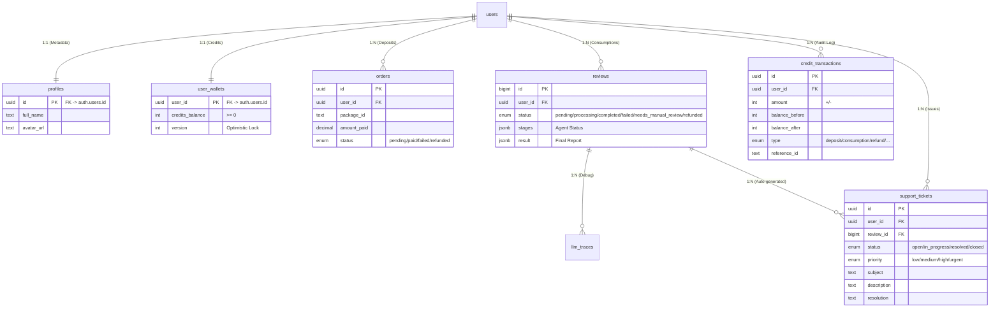

# AI 辅助论文审批系统数据库设计 (Supabase Schema V2.0)

**版本**: v2.1  
**日期**: 2026-03-16  
**作者**: Colin  
**基于**: PRD v2.0 & Billing System Design v1.0 & User Feedback (Add Ticket System)

---

## 1. 设计概述 (Design Overview)

本数据库设计旨在支撑 **AI 辅助论文智能审批网站 (V2.0)** 的核心业务流程，特别是**计费系统**、**多智能体审阅**以及**异常工单处理**。

### 1.1 核心原则 (Core Principles)
1.  **Supabase-First**: 利用 Auth, RLS, Realtime, Storage 等原生能力。
2.  **强一致性 (Strong Consistency)**: 资金相关表 (Wallets, Transactions) 必须保证原子性和准确性。
3.  **审计追踪 (Audit Trail)**: 关键操作 (支付、扣费、退款) 必须有不可篡改的流水记录。
4.  **闭环运维 (Ops Loop)**: 通过工单系统 (Tickets) 将异常任务、用户反馈与管理员操作闭环。

### 1.2 实体关系图 (ER Diagram)



---

## 2. 表结构定义 (Table Definitions)

### 2.1 用户档案表 (`public.profiles`)
用于存储 `auth.users` 之外的用户扩展信息。

```sql
create table public.profiles (
  id uuid not null references auth.users(id) on delete cascade primary key,
  full_name text,
  avatar_url text,
  role text default 'user' check (role in ('user', 'admin')),
  preferences jsonb default '{}'::jsonb, -- 存储用户偏好 (e.g. theme, language)
  created_at timestamptz default now(),
  updated_at timestamptz default now()
);

-- RLS
alter table public.profiles enable row level security;
create policy "Users can view own profile" on profiles for select using (auth.uid() = id);
create policy "Users can update own profile" on profiles for update using (auth.uid() = id);
```

### 2.2 用户钱包表 (`public.user_wallets`)
存储用户的点数余额。**核心资产表**。

```sql
create table public.user_wallets (
  user_id uuid not null references auth.users(id) on delete cascade primary key,
  credits_balance int not null default 0 check (credits_balance >= 0), -- 余额严禁为负
  version int not null default 0, -- 乐观锁版本号，防止并发扣费冲突
  created_at timestamptz default now(),
  updated_at timestamptz default now()
);

-- RLS: 用户仅可查看，不可直接修改
alter table public.user_wallets enable row level security;
create policy "Users can view own wallet" on user_wallets for select using (auth.uid() = user_id);
-- Update Policy: 仅限 Service Role (后端 API) 修改
```

### 2.3 订单表 (`public.orders`)
记录充值订单状态，用于对接支付网关 (Zpay)。

```sql
create type order_status as enum ('pending', 'paid', 'failed', 'refunded');

create table public.orders (
  id uuid default gen_random_uuid() primary key,
  user_id uuid not null references auth.users(id) on delete cascade,
  package_id text not null, -- 对应配置文件中的套餐 ID (e.g., 'pkg_standard')
  amount_paid decimal(10, 2) not null, -- 实际支付金额 (CNY)
  credits_added int not null, -- 购买的点数
  status order_status default 'pending',
  provider_order_id text, -- 支付渠道方订单号
  provider_payment_method text, -- 支付方式 (alipay/wechat)
  metadata jsonb, -- 额外信息
  created_at timestamptz default now(),
  updated_at timestamptz default now()
);

-- Index
create index idx_orders_user_id on orders(user_id);
create index idx_orders_status on orders(status);

-- RLS
alter table public.orders enable row level security;
create policy "Users can view own orders" on orders for select using (auth.uid() = user_id);
```

### 2.4 资金流水表 (`public.credit_transactions`)
记录每一笔点数变动，用于审计和对账。**Append-only (只增不改)**。

```sql
create type transaction_type as enum (
  'deposit',          -- 充值
  'consumption',      -- 消费 (审阅)
  'refund',           -- 退款 (增加余额)
  'admin_adjustment', -- 管理员手动调整
  'bonus'             -- 活动赠送
);

create table public.credit_transactions (
  id uuid default gen_random_uuid() primary key,
  user_id uuid not null references auth.users(id) on delete cascade,
  amount int not null, -- 变动金额: +10, -1
  balance_before int not null, -- 变动前余额 (审计关键)
  balance_after int not null, -- 变动后余额 (审计关键)
  type transaction_type not null,
  reference_id text, -- 关联 ID: Order ID (充值) 或 Review ID (消费)
  metadata jsonb, -- 额外说明: {"reason": "task_failed_retry"}
  created_at timestamptz default now()
);

-- Index
create index idx_transactions_user_id on credit_transactions(user_id);
create index idx_transactions_created_at on credit_transactions(created_at);

-- RLS
alter table public.credit_transactions enable row level security;
create policy "Users can view own transactions" on credit_transactions for select using (auth.uid() = user_id);
```

### 2.5 核心审阅任务表 (`public.reviews`)
存储论文审阅任务的状态、进度和结果。

```sql
create type review_status as enum (
  'pending',              -- 等待处理
  'processing',           -- 处理中 (Agents Running)
  'completed',            -- 完成
  'failed',               -- 技术性失败 (可重试)
  'needs_manual_review',  -- 异常挂起，需人工介入 (PRD 8.1)
  'refunded',             -- 已退款 (终止)
  'cancelled'             -- 用户取消
);

create table public.reviews (
  id bigint primary key generated by default as identity,
  user_id uuid not null references auth.users(id) on delete cascade,
  
  -- 文件信息
  file_url text not null, -- Supabase Storage Path
  file_name text, -- 原始文件名
  page_count int, -- 页数 (用于计费核对)
  
  -- 任务状态
  status review_status not null default 'pending',
  cost int not null default 0, -- 本次任务消耗的点数 (用于退款参考)
  
  -- 进度追踪 (Parallel Agents)
  -- 结构示例: [{"agent": "format", "status": "done"}, {"agent": "logic", "status": "running"}]
  stages jsonb default '[]'::jsonb, 
  
  -- 最终结果
  result jsonb, -- 包含 format_result, logic_result, reference_result 等
  error_message text, -- 错误原因
  
  -- 运维字段
  trigger_run_id text, -- Trigger.dev Job ID
  
  created_at timestamptz default now(),
  updated_at timestamptz default now(),
  completed_at timestamptz
);

-- Index
create index idx_reviews_user_id on reviews(user_id);
create index idx_reviews_status on reviews(status);

-- Realtime: 开启 Replica Identity 支持 Update 推送
alter table public.reviews replica identity full;

-- RLS
alter table public.reviews enable row level security;
create policy "Users can view own reviews" on reviews for select using (auth.uid() = user_id);
-- Insert/Update Policy: 仅限 Service Role
```

### 2.6 工单系统表 (`public.support_tickets`)
用于处理异常任务、用户反馈及退款申请 (PRD 8.1)。

```sql
create type ticket_status as enum ('open', 'in_progress', 'resolved', 'closed');
create type ticket_priority as enum ('low', 'medium', 'high', 'urgent');
create type ticket_category as enum ('system_error', 'refund_request', 'billing_issue', 'general_inquiry');

create table public.support_tickets (
  id uuid default gen_random_uuid() primary key,
  user_id uuid not null references auth.users(id) on delete cascade,
  review_id bigint references reviews(id) on delete set null, -- 关联的审阅任务 (Optional)
  
  category ticket_category not null default 'general_inquiry',
  subject text not null, -- e.g., "Review Task #123 Failed"
  description text, -- 自动生成的错误描述或用户输入
  
  status ticket_status default 'open',
  priority ticket_priority default 'medium',
  
  resolution text, -- 解决方案描述 (e.g., "Refunded 3 credits", "Retried successfully")
  admin_id uuid references auth.users(id), -- 处理人 ID
  
  created_at timestamptz default now(),
  updated_at timestamptz default now()
);

-- Index
create index idx_tickets_user_id on support_tickets(user_id);
create index idx_tickets_status on support_tickets(status);
create index idx_tickets_review_id on support_tickets(review_id);

-- RLS
alter table public.support_tickets enable row level security;
create policy "Users can view own tickets" on support_tickets for select using (auth.uid() = user_id);
create policy "Users can create tickets" on support_tickets for insert with check (auth.uid() = user_id);
-- Admins can view/update all (handled by Service Role or Admin Policy)
```

### 2.7 审计日志表 (`public.activity_logs`)
记录关键操作日志 (PRD 8.2)。

```sql
create table public.activity_logs (
  id uuid default gen_random_uuid() primary key,
  user_id uuid references auth.users(id) on delete set null,
  action text not null, -- e.g., 'UPLOAD_FILE', 'START_REVIEW', 'DOWNLOAD_REPORT', 'VIEW_PRICING', 'CREATE_TICKET'
  metadata jsonb, -- e.g., { "file_size": 1024, "ip": "1.2.3.4", "user_agent": "..." }
  ip_address text,
  created_at timestamptz default now()
);

-- RLS: 仅管理员可见
alter table public.activity_logs enable row level security;
```

### 2.8 LLM 调试追踪表 (`public.llm_traces`)
用于调试 Bad Case，记录每次 LLM 的输入输出。

```sql
create table public.llm_traces (
  id uuid default gen_random_uuid() primary key,
  review_id bigint references reviews(id) on delete set null,
  agent_name text, -- e.g., 'format_agent'
  model_name text, -- e.g., 'gemini-1.5-pro'
  prompt_tokens int,
  completion_tokens int,
  cost_usd numeric(10, 6),
  latency_ms int,
  input_snapshot text, -- 截断存储，避免过大
  output_snapshot text,
  created_at timestamptz default now()
);

-- RLS: 仅管理员可见
alter table public.llm_traces enable row level security;
```

---

## 3. 数据库函数与触发器 (Functions & Triggers)

### 3.1 自动创建用户档案 (handle_new_user)
当用户注册时，自动在 `profiles` 和 `user_wallets` 表中创建记录。

```sql
create or replace function public.handle_new_user()
returns trigger as $$
begin
  -- 创建 Profile
  insert into public.profiles (id, full_name, avatar_url)
  values (new.id, new.raw_user_meta_data->>'full_name', new.raw_user_meta_data->>'avatar_url');
  
  -- 创建 Wallet (初始余额 0)
  insert into public.user_wallets (user_id, balance, version)
  values (new.id, 0, 0);
  
  return new;
end;
$$ language plpgsql security definer;

-- 绑定到 auth.users
create trigger on_auth_user_created
  after insert on auth.users
  for each row execute procedure public.handle_new_user();
```

### 3.2 自动更新 `updated_at`

```sql
create extension if not exists moddatetime schema extensions;

create trigger handle_updated_at before update on public.profiles
  for each row execute procedure moddatetime (updated_at);

create trigger handle_updated_at before update on public.user_wallets
  for each row execute procedure moddatetime (updated_at);

create trigger handle_updated_at before update on public.orders
  for each row execute procedure moddatetime (updated_at);

create trigger handle_updated_at before update on public.reviews
  for each row execute procedure moddatetime (updated_at);
  
create trigger handle_updated_at before update on public.support_tickets
  for each row execute procedure moddatetime (updated_at);
```

---

## 4. 存储桶配置 (Storage Buckets)

### Bucket: `thesis-files`
*   **用途**: 存储用户上传的 PDF 原始文件。
*   **权限**: Private。
*   **RLS**: 仅 Owner 可读写。

### Bucket: `review-reports`
*   **用途**: 存储生成的 PDF 报告。
*   **权限**: Private。
*   **RLS**: 仅 Owner 可读。

