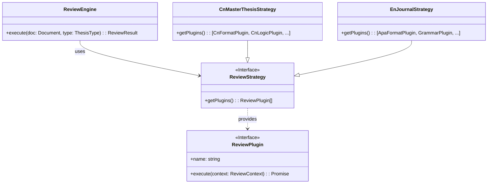

# 国际化 (i18n) 与插件化架构技术方案 (Tech Spec) v1.0

| 版本 | 日期 | 作者 | 状态 |
| :--- | :--- | :--- | :--- |
| v1.0 | 2026-03-15 | Colin | Draft |

## 1. 概述 (Overview)

本方案旨在落实 PRD v2.0 中提出的 "Day 1 国际化与插件化" 架构愿景。
1.  **国际化 (i18n)**: 采用 `next-intl` 构建多语言基础设施，支持无缝切换中英文界面，并解决与 Supabase Auth 中间件的冲突。
2.  **插件化 (Plugin Arch)**: 设计一套基于 **策略模式 (Strategy Pattern)** 与 **责任链模式 (Chain of Responsibility)** 的审阅引擎架构，使不同类型的论文（中文毕业论文、英文期刊等）能够动态加载不同的审阅规则（Agents）。

本方案将基于现有的 "三层架构" 进行扩展，确保与 `Tech_Spec_Auth_v1.0.md` 中定义的 Auth 模块兼容。

---

## 2. 国际化架构 (Internationalization)

### 2.1 技术选型
*   **库**: `next-intl` (App Router 完美支持，Server Components 友好)。
*   **路由策略**: 基于路径前缀 (Path-based routing)，例如 `/zh/dashboard`, `/en/dashboard`。
*   **默认语言**: `zh` (中文)。

### 2.2 目录结构调整
现有的 `app/*` 结构需要迁移至 `app/[locale]/*` 以支持动态路由。

```text
app/
├── (auth)/               -> 迁移至 app/[locale]/(auth)/
├── dashboard/            -> 迁移至 app/[locale]/dashboard/
├── api/                  -> 保持不变 (API 通常不走 locale 前缀，或通过 Header 控制)
├── [locale]/             <-- 新增根动态路由
│   ├── (auth)/           <-- Auth 页面
│   ├── dashboard/        <-- 业务页面
│   ├── layout.tsx        <-- RootLayout (包含 NextIntlClientProvider)
│   └── page.tsx          <-- 落地页
└── i18n/                 <-- i18n 配置目录
    ├── request.ts        <-- next-intl 请求配置
    └── routing.ts        <-- 路由配置
messages/                 <-- 翻译文件
├── en.json
└── zh.json
```

### 2.3 中间件链 (Middleware Chaining)
**核心挑战**: Next.js 只有一个 `middleware.ts` 入口，但我们需要同时运行 `Supabase Auth` (Session 管理) 和 `next-intl` (路由重定向/Locale 检测)。

**解决方案**: 封装中间件链。

```typescript
// middleware.ts 伪代码
import createMiddleware from 'next-intl/middleware';
import { updateSession } from '@/lib/supabase/middleware';

const intlMiddleware = createMiddleware({
  locales: ['en', 'zh'],
  defaultLocale: 'zh'
});

export async function middleware(request: NextRequest) {
  // 1. 先运行 Supabase Auth (刷新 Session, 处理 RLS)
  // 注意：Supabase updateSession 必须返回 response，以便设置 Cookie
  const { response: supabaseResponse, user } = await updateSession(request);
  
  // 2. 如果 Auth 决定重定向 (如未登录访问 Dashboard)，直接返回
  if (supabaseResponse.headers.get('location')) {
    return supabaseResponse;
  }

  // 3. 运行 next-intl 中间件 (处理 / -> /zh, Locale 检测)
  // 需传入 supabaseResponse 以保留 Auth 设置的 Cookie
  const intlResponse = intlMiddleware(request);
  
  // 4. 合并 Headers (关键：保留 Auth 的 Set-Cookie)
  supabaseResponse.headers.forEach((value, key) => {
    intlResponse.headers.set(key, value);
  });

  return intlResponse;
}

export const config = {
  matcher: ['/((?!api|_next|.*\\..*).*)']
};
```

---

## 3. 插件化审阅引擎 (Plugin Architecture)

### 3.1 核心概念
为了支持多种论文类型 (Thesis Type) 和审阅维度 (Dimension)，我们将审阅逻辑抽象为 **插件 (Plugin)**。

*   **ReviewContext**: 审阅上下文，包含论文内容(Text/PDF)、元数据(Metadata)、用户配置(Config)。
*   **ReviewPlugin**: 最小执行单元（原子能力）。例如：`FormatCheckPlugin`（格式检查）、`LogicCheckPlugin`（逻辑检查）。
*   **ReviewStrategy**: 针对特定论文类型的插件组合策略。例如：`CN_MASTER_THESIS_STRATEGY`。
*   **ReviewEngine**: 引擎核心，负责加载策略并执行插件。

### 3.2 架构设计 (Class Diagram)



### 3.3 目录结构 (Directory)

```text
lib/
├── engine/
│   ├── core.ts           <-- ReviewEngine 实现
│   ├── context.ts        <-- ReviewContext 定义
│   └── types.ts          <-- 接口定义
├── plugins/
│   ├── base.plugin.ts    <-- 插件基类
│   ├── common/           <-- 通用插件 (如: 文本提取, 基础统计)
│   ├── cn-thesis/        <-- 中文论文专用插件
│   │   ├── format.plugin.ts
│   │   └── logic.plugin.ts
│   └── en-journal/       <-- (Phase 2) 英文期刊插件
└── strategies/
    ├── registry.ts       <-- 策略注册表
    ├── cn-master.ts      <-- 中文硕士论文策略
    └── cn-bachelor.ts    <-- 中文本科论文策略
```

### 3.4 与现有三层架构的集成

在 `Tech_Spec_Auth_v1.0.md` 定义的架构中，Review Engine 属于 **业务逻辑层 (Business Logic Layer)** 的一部分，通常被 `ReviewService` 调用。

**调用链路**:
1.  **Action**: `startReview(fileId, thesisType)`
2.  **Service**: `reviewService.start(fileId, thesisType)`
    *   从 DB 读取文件信息。
    *   初始化 `ReviewEngine`。
    *   `engine.execute(doc, thesisType)`。
3.  **Engine**:
    *   根据 `thesisType` 查找 `Strategy`。
    *   实例化插件链。
    *   并发或串行执行插件（支持 Async/Await）。
    *   返回聚合结果。
4.  **DAL**: `reviewDAL.saveResult(result)` 保存至数据库。

---

## 4. 开发计划 (Implementation Plan)

### Phase 1: i18n 基础设施 (预计 2 天)
1.  [ ] **安装与配置**: 安装 `next-intl`，创建 `messages/zh.json` (默认) 和 `messages/en.json`。
2.  [ ] **路由迁移**: 将现有 `app/` 页面迁移至 `app/[locale]/`。
3.  [ ] **中间件改造**: 编写 `middleware.ts`，合并 Supabase Auth 和 next-intl 逻辑。
4.  [ ] **组件适配**: 替换硬编码文本为 `t('key')`，使用 `Link` 组件替换 next/link。

### Phase 2: 插件引擎核心 (预计 3 天)
1.  [ ] **核心接口定义**: 定义 `ReviewPlugin`, `ReviewContext`, `ReviewStrategy` 接口。
2.  [ ] **基础插件实现**: 实现一个 Demo 插件 (e.g., `WordCountPlugin`)。
3.  [ ] **引擎实现**: 编写 `ReviewEngine`，支持按策略加载插件。
4.  [ ] **集成测试**: 编写单元测试验证插件加载和执行流程。

### Phase 3: 业务落地 (结合 MVP)
1.  [ ] **中文毕业论文策略**: 实现 `CnMasterThesisStrategy`。
2.  [ ] **MVP 插件开发**:
    *   `CnFormatPlugin`: 检查章节标题。
    *   `CnLogicPlugin`: (Mock) 模拟逻辑分析输出。
3.  [ ] **Service 集成**: 在 `ReviewService` 中接入引擎。

---

## 5. 注意事项

1.  **Server Actions 与 i18n**: Server Actions 内部通常不需要知道 locale，但如果 Action 返回错误消息给前端，建议返回 Error Code，由前端根据 locale 翻译，而不是在后端翻译。
2.  **插件性能**: 插件应设计为无状态 (Stateless) 或 幂等 (Idempotent)。对于耗时插件（如调用 LLM），Engine 需支持异步流式输出 (Streaming) 或 任务队列机制 (Job Queue)。
3.  **Auth 兼容**: 确保 `/auth/callback` 路由能正确处理 locale 重定向，或者保持 callback 路由在根目录下 (不带 locale)，处理完后再重定向到 `/[locale]/dashboard`。
